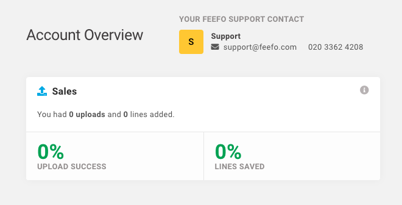

# Feefo: UI Technical Assessment

Implement the design provided in `design.png` as a set of React components.

There is a stub for the data structure in `app.js`. Please use this to drive the view content and derive any calculated data from this in your components. The container component has also been created `AccountOverview` `./src/account-overview.jsx`.

## We would like to see
- The layout should grow/shrink sensibly with the viewport
- The design split into several components
- Usage of `proptypes`
- Unit tests covering your components
- a11y considered and relevant ARIA attributes added

## Technical Notes
- Assets for the font in the design (roboto) have been included via google fonts
- Font Awesome icons are available via the Font Awesome React bindings (there is a usage example in `account-overview.jsx`)
- The repository is set up to work with `styled-components` if you feel comfortable doing so, please use this instead of css
- The repository is set up to use jest + testing library for unit tests

## Setup
1. Run `npm install` to install required dependencies
2. Run `npm run start` to start a local development server

Note: if you're having issues with node, try to set `export NODE_OPTIONS=--openssl-legacy-provider`

## Available Scripts

In the project directory, you can run:

### `npm start`

Runs the app in the development mode.\
Open [http://localhost:3000](http://localhost:3000) to view it in the browser.

The page will reload if you make edits.\
You will also see any lint errors in the console.

### `npm test`

Launches the test runner in the interactive watch mode.\
See the section about [running tests](https://facebook.github.io/create-react-app/docs/running-tests) for more information.

## Future Improvements

1.  Acessibility (a11y) support and ARIA roles

Due to my lack of knowledge setting ARIA roles, I didn't provide any. However, in the future, it would be a strongly relevant improvement.

2.  Responsiveness

The app is responsive because it is grid-based and uses some media breakpoints to improve responsiveness for mobile devices. However, a mock-up of the mobile version of the app would be ideal for future improvements.

3.  Tokens Library

Ideally, in the future, a token library for spacing, colors, etc, would be ideal to avoid coping those values over all the app, and also defining patterns for the application.

## Decisions

1.  Components Structure

The components structure chosen is a good fit for an application that will scale, having multiple pages, with multiple private components, and multiple shared components.

2.  Account Overview Tests

The tests for the AccountOverview component itself were treated as integration tests. So, their only responsability is to ensure that the AccountOverview is rendering the expected children components.
